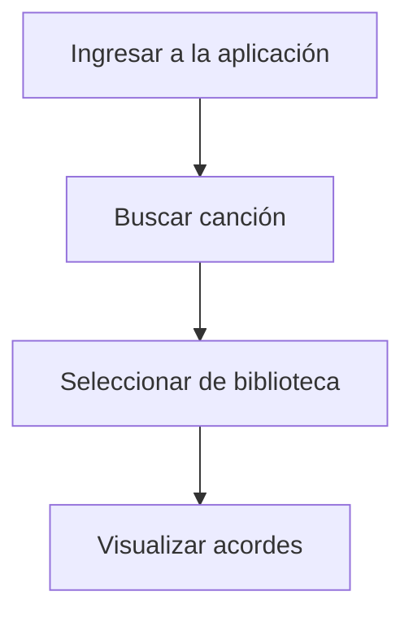
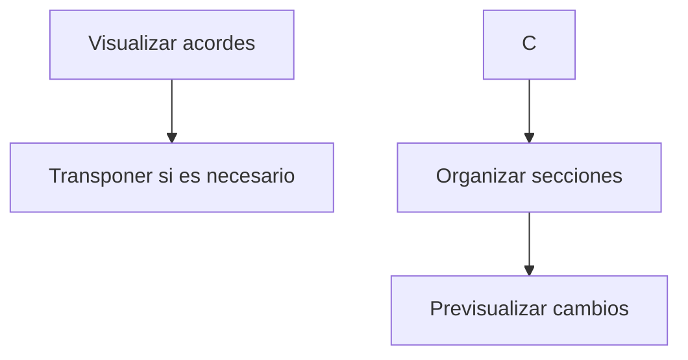
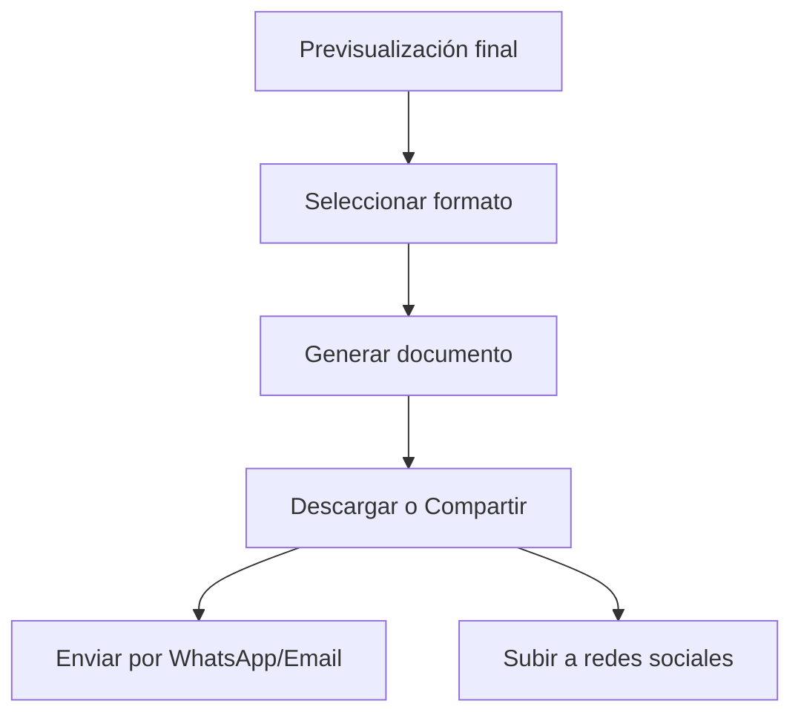
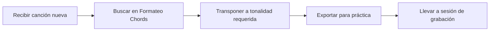
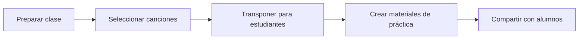
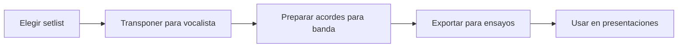

# 📝 Documentación - Formateo Chords

## 🎵 Descripción del Proyecto

**Formateo Chords** es una aplicación web moderna diseñada específicamente para músicos. Ofrece herramientas especializadas para formatear, visualizar y gestionar acordes musicales, partituras y materiales de práctica.


# 🎵 Formateo Chords - Documentación Completa

## 📖 ¿Qué es Formateo Chords?

**Formateo Chords** es una aplicación web especializada diseñada específicamente para músicos, cantantes y amantes de la música. Sirve como un centro integral para gestionar, visualizar, formatear y compartir acordes musicales, partituras y materiales de práctica.

### 🎯 Propósito Principal
Facilitar el proceso de aprendizaje, práctica y ejecución de canciones mediante herramientas digitales optimizadas para músicos. La aplicación permite transformar acordes complejos en formatos visualmente claros y personalizables.

## 🎹 Funcionalidades Principales

### 1. 📋 Biblioteca de Acordes Organizada
- **Almango Database**: Acordes oficiales y verificados
- **Covers Collection**: Versiones y adaptaciones musicales
- **Búsqueda Inteligente**: Filtrado por género, artista y dificultad

### 2. 🎚️ Sistema de Transposición Avanzado
```javascript
// Transposición en tiempo real
Transposición de Do → Re → Mi → Fa...
// Sin necesidad de recalcular manualmente
```

### 3. 📤 Exportación Profesional
- **Formatos**: PDF para impresión, JPG para digital
- **Estilos Optimizados**: Para lectura durante presentaciones
- **Personalizable**: Tamaños y layouts adaptables

### 4. 📱 Compartición Social
- **WhatsApp**: Envío directo de acordes
- **Redes Sociales**: Facebook, Instagram
- **Email**: Compartir con bandas o estudiantes

## 🏗️ Arquitectura de Componentes

### Componentes Principales y su Función

#### 🎮 `Header.jsx` - Navegación Principal
**Función**: Barra de navegación superior con acceso rápido
**Contiene**:
- Logo y marca de la aplicación
- Menú de categorías musicales
- Barra de búsqueda inteligente
- Acceso a usuario y configuración

#### 📚 `Sidebar.jsx` - Herramientas Musicales
**Función**: Panel lateral de herramientas especializadas
**Herramientas incluidas**:
```
🎵 Transposición (Subir/Bajar tonos)
📝 Listados de Acordes
🎼 Partes de Canción (Intro, Verso, Coro, Puente)
🎸 Instrumentos (Guitarra, Piano, Bajo, Ukulele)
🎚️ Afinador Digital
⏱️ Metrónomo Interactivo
✅ Sistema To-Do para prácticas
```

#### 📖 `ChordsAlmango.jsx` - Visualizador Principal
**Función**: Visualización y gestión de acordes Almango
**Características**:
- **Transposición en Tiempo Real**: Modificar tonalidades al vuelo
- **Estructura Organizada**: Acordes → Letra de forma clara
- **Información Completa**: Tempo, compás, capo, tonalidad
- **Exportación Profesional**: Formatos optimizados para músicos

#### 🎸 `ChordsViewer.jsx` - Biblioteca de Covers
**Función**: Gestión de versiones y adaptaciones musicales
**Características**:
- **Filtrado por Género**: Rock, Pop, Jazz, Clásica, etc.
- **Sistema de Categorías**: Organización inteligente
- **Imágenes de Referencia**: Partituras y diagramas
- **Compartición Rápida**: Envío a redes sociales

#### 📞 `Contacto.jsx` - Comunicación Unificada
**Función**: Centro de contacto y redes sociales
**Integraciones**:
- **Formulario de Contacto**: Comunicación directa
- **Redes Sociales**: Instagram, YouTube, Facebook, Spotify
- **Donaciones**: PayPal para colaboraciones
- **Email Directo**: Contacto rápido

#### 📄 `Footer.jsx` - Información Corporativa
**Función**: Pie de página informativo
**Contenido**:
- **Enlaces Rápidos**: Acceso a secciones importantes
- **Redes Sociales**: Iconos con enlaces directos
- **Información Legal**: Copyright y derechos
- **Créditos de Desarrollo**: Gondra World Dev

## 🎼 Sistema de Acordes y Notación

### Estructura de Datos Musicales
```json
{
  "id": "unique-song-id",
  "Cancion": "Nombre de la Canción",
  "Artista": "Artista o Banda",
  "Genero": "Rock/Pop/Jazz",
  "tempo": "120 BPM",
  "compas": "4/4",
  "capo": "Traste del capo",
  "tonoOriginal": "Tonalidad original",
  "tonoActual": "Tonalidad actual (transpuesta)",
  "Secciones": [
    {
      "titulo": "Introducción",
      "acordes": ["C", "G", "Am", "F"],
      "letra": "Letra de esta sección..."
    }
  ]
}
```

### 🔧 Proceso de Transposición
```
1. Detectar acorde original (ej: Do)
2. Calcular nuevo posición (ej: +2 semitonos)
3. Convertir a nuevo acorde (ej: Re)
4. Aplicar a todos los acordes de la canción
5. Actualizar interfaz en tiempo real
```

## 🎨 Flujo de Trabajo del Usuario

### 1. 🎯 Búsqueda y Selección


### 2. 🎚️ Personalización y Ajuste


### 3. 📤 Exportación y Compartición


## 🎹 Tipos de Acordes Soportados

### Acordes Básicos
```
C - Do Mayor
Cm - Do Menor
C7 - Do Séptima
C# - Do Sostenido
Cdim - Do Disminuido
```

### Acordes Avanzados
```
Cmaj7 - Do Mayor Séptima
C9 - Do Novena
Cadd9 - Do con Novena Añadida
Csus4 - Do Suspendido en 4ta
```

### Notación Especial
```
/ - Slide (ej: C/G)
~ - Vibrato
h - Hammer-on
p - Pull-off
b - Bend
```

## 📊 Sistema de Categorías

### Géneros Musicales
- **🎸 Rock**: Clásico, Alternativo, Punk
- **🎹 Pop**: Contemporáneo, Synthpop, K-Pop
- **🎷 Jazz**: Tradicional, Fusion, Smooth
- **🎻 Clásica**: Baroque, Romantic, Contemporary
- **🎵 Latino**: Salsa, Reggaeton, Bachata
- **⚡ Electrónica**: House, Techno, Trance

### Niveles de Dificultad
- **⭐ Principiante**: Acordes básicos, tempo lento
- **⭐⭐ Intermedio**: Acordes complejos, cambios rápidos
- **⭐⭐⭐ Avanzado**: Acordes extendidos, técnicas especiales

## 🔧 Herramientas Técnicas Integradas

### 🎚️ Afinador Digital
- **Frecuencias Precisas**: 440Hz estándar
- **Instrumentos**: Guitarra, Bajo, Ukulele, Violín
- **Modos**: Automático y Manual

### ⏱️ Metrónomo
- **Rango**: 40-240 BPM
- **Compases**: 2/4, 3/4, 4/4, 6/8
- **Acentos**: Personalizables por tiempo

### 📝 Lista de Práctica
- **Seguimiento de Progreso**
- **Recordatorios de Práctica**
- **Estadísticas de Mejora**

## 🌐 Compatibilidad y Requisitos

### Dispositivos Soportados
- **📱 Móviles**: iOS 12+, Android 8+
- **💻 Tabletas**: iPadOS 13+, Android Tablet
- **🖥️ Desktop**: Windows 10+, macOS 10.14+, Linux

### Navegadores Compatibles
- **Chrome**: Versión 80+
- **Firefox**: Versión 75+
- **Safari**: Versión 13+
- **Edge**: Versión 80+

### 📊 Requisitos Técnicos
```bash
# Memória RAM: 2GB mínimo (4GB recomendado)
# Almacenamiento: 50MB para la aplicación
# Conexión: Internet para cargar biblioteca
```

## 🚀 Casos de Uso Típicos

### 1. 🎸 Músico de Sesión


### 2. 🎵 Profesor de Música


### 3. 🎤 Cantante/Banda


## 📈 Beneficios para Músicos

### ⏱️ Ahorro de Tiempo
- **Transposición automática**: 2 minutos vs 20 minutos manuales
- **Búsqueda instantánea**: Segundos vs minutos en libros
- **Organización automática**: Sin carpetas físicas

### 🎯 Precisión Mejorada
- **Acordes verificados**: Sin errores de transcripción
- **Consistencia**: Mismo formato en todas las canciones
- **Actualizaciones**: Correcciones en tiempo real

### 💰 Economía
- **Libros digitales**: Sin costo de partituras físicas
- **Actualizaciones gratuitas**: Sin comprar nuevas ediciones
- **Almacenamiento cloud**: Sin espacio físico ocupado

## 🔮 Roadmap Futuro

### 🚀 Próximas Características
- **🎤 Reconocimiento de Audio**: Transcribir canciones automáticamente
- **🎸 Diagramas Interactivos**: Posiciones de acordes visuales
- **🎶 PlayAlong**: Reproducción con backing tracks
- **📊 Analytics**: Seguimiento de progreso musical
- **🤝 Comunidad**: Compartir arreglos con otros músicos

### 📱 Mejoras Técnicas
- **App Nativa**: iOS y Android
- **Offline Mode**: Funcionamiento sin internet
- **Sync Multi-device**: Sincronización entre dispositivos
- **API Pública**: Para desarrolladores de apps musicales

---

## 🎉 ¡Únete a la Comunidad Musical!

**Formateo Chords** no es solo una herramienta, es una comunidad de músicos apasionados que buscan mejorar su arte a través de la tecnología. ¡Sube de nivel tu práctica musical hoy!

[🎵 Empezar Ahora] | [📚 Ver Tutoriales] | [🎸 Comunidad]

---

*¿Preguntas o sugerencias?* ¡Nos encantaría escucharte! Únete a nuestra comunidad de músicos y contribuye al desarrollo de las mejores herramientas para artistas.


## 🎨 Guía de Estética y Diseño

### Paleta de Colores Principal

| Color | Código | Uso |
|-------|--------|-----|
| Negro Elegante | `#1a1a1a` | Fondos principales |
| Negro Secundario | `#2a2a2a` | Fondos secundarios |
| Rojo Coral | `#e63946` | Acentos, bordes, elementos interactivos |
| Dorado Moderno | `#ffd166` | Textos destacados, iconos |
| Blanco Hueso | `#f8f9fa` | Texto principal |
| Gris Claro | `#e9ecef` | Texto secundario |

### Tipografía

- **Primaria**: `Montserrat` - Para textos y interfaces
- **Secundaria**: `Cinzel` - Para títulos y elementos destacados  
- **Monospace**: `Fira Code` - Para código y acordes musicales

### Iconografía

- **React Icons/BS**: Bootstrap Icons para acciones generales
- **React Icons/FI**: Feather Icons para elementos musicales
- **Tamaños**: Consistente en 16px, 20px, 24px según jerarquía

## 🏗️ Arquitectura Técnica

### Estructura de Carpetas

```
src/
├── assets/
│   ├── scss/
│   │   ├── _01-General/          # Estilos globales
│   │   └── _03-Componentes/      # Estilos por componente
│   └── img/                      # Recursos multimedia
├── componentes/                  # Componentes React
├── hooks/                       # Custom hooks
└── utils/                       # Utilidades y helpers
```

### Tecnologías Utilizadas

| Tecnología | Versión | Propósito |
|------------|---------|-----------|
| React | 18.x | Framework principal |
| React Router DOM | 6.x | Navegación |
| React Icons | 4.x | Iconografía |
| Bootstrap | 5.x | Componentes base |
| SASS/SCSS | 1.5+ | Estilos |
| jsPDF | 2.x | Exportación PDF |
| html2canvas | 1.x | Captura de pantalla |

## 🎯 Componentes Principales

### Header (`Header.jsx`)
- **Función**: Navegación principal y búsqueda
- **Características**: Responsive, con menú colapsable
- **Estilos**: `_Header.scss`

### Sidebar (`Sidebar.jsx`) 
- **Función**: Herramientas musicales rápidas
- **Contiene**: Transposición, afinador, metrónomo
- **Estilos**: `_Sidebar.scss`

### ChordsAlmango (`ChordsAlmango.jsx`)
- **Función**: Visualizador de acordes Almango
- **Features**: Transposición en tiempo real, exportación
- **Estilos**: `_ChordsAlmango.scss`

### ChordsViewer (`ChordsViewer.jsx`)
- **Función**: Biblioteca de covers musicales
- **Features**: Filtros por género, compartir en redes
- **Estilos**: `_ChordsViewer.scss`

### Footer (`Footer.jsx`)
- **Función**: Información y redes sociales
- **Estilos**: `_Footer.scss`

## 🎹 Funcionalidades Musicales

### Sistema de Transposición
```javascript
const transposeChord = (chord) => {
  const chords = ["C", "C#", "D", "D#", "E", "F", "F#", "G", "G#", "A", "A#", "B"];
  const index = chords.indexOf(chord);
  if (index === -1) return chord;
  const newIndex = (index + transposition + 12) % 12;
  return chords[newIndex];
};
```

### Exportación de Acordes
- **Formatos**: PDF y JPG
- **Herramientas**: jsPDF + html2canvas
- **Personalización**: Estilos optimizados para impresión

### Gestión de Datos Musicales
- **Estructura JSON**: Organizada por canciones y secciones
- **Campos**: Acordes, letras, tempo, compás, capo, tonalidad

## 📱 Diseño Responsive

### Breakpoints Implementados

| Dispositivo | Breakpoint | Características |
|-------------|------------|-----------------|
| Móvil | < 480px | Navegación simplificada |
| Tablet | 768px | Layout adaptativo |
| Desktop | 1024px | Experiencia completa |
| Large Desktop | 1200px+ | Contenido expandido |

### Estrategia Mobile-First
```scss
// Base móvil
.componente {
  padding: 1rem;
  font-size: 1rem;
}

// Tablet
@media (min-width: 768px) {
  .componente {
    padding: 1.5rem;
    font-size: 1.1rem;
  }
}

// Desktop  
@media (min-width: 1024px) {
  .componente {
    padding: 2rem;
    font-size: 1.2rem;
  }
}
```

## 🎨 Directrices de Estilos SCSS

### Estructura de Archivos SCSS
```scss
/* =============================================== */
/* NOMBRE_COMPONENTE - Descripción
/* =============================================== */

// Variables locales (si son necesarias)
$color-local: #e63946;

// Estilos base
.componente {
  prop: valor;
}

// Elementos hijos
.elemento-hijo {
  prop: valor;
}

// Estados e interacciones
&:hover {
  prop: valor;
}

// Media queries
@media (min-width: 768px) {
  .componente {
    prop: valor;
  }
}
```

### Reglas de Estilos
1. **Sin mixins ni variables globales** en SCSS
2. **Mobile-first** con breakpoints progresivos
3. **Padding mínimo** en móviles (0.5rem)
4. **Incremento progresivo** en breakpoints
5. **Contraste mínimo** 4.5:1 para accesibilidad
